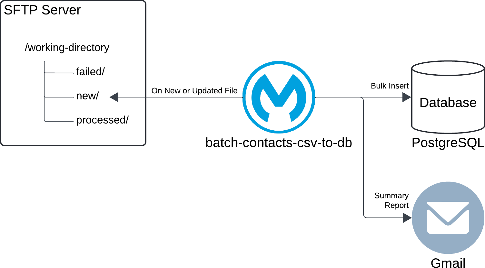

# Mule 4 Batch Job Examples

As of this writing, this repository contains a single Mule application I created to explain and demonstrate how to implement a batch job in Mule 4. I did not implement it to address a specific use case but to serve as a comprehensive example that illustrates the art of the possible. There are many examples across the web and in blog posts. Nevertheless, I am sharing this example as it is more comprehensive than most, if not all. Note that I plan to add another example soon.

## Contacts CSV File to Database Example

As implied, the Contacts CSV File to Database Example reads contact data from a CSV file and inserts it into a database. Furthermore, it sends a summary report upon completion via email. 

As the diagram illustrates, I upload my contact data to an SFTP server and leverage a PostgreSQL database and Gmail. Naturally, you could change those as needed to meet your demo requirements.

## Repository Content

- The folder **anypoint-studio-projects** includes the source code of the Mule application.
- The folder **documentation** contains an [Overview](documentation/Overview.md) document, which provides additional details on the Mule application and its implementation.
- The folder **resources** includes miscellaneous resources for setting up the environment - e.g., sample contact data, script for setting up the database. This folder contains a [README](resources/_README.md) file that provides additional details.

## Technology Stack Overview

The assets and resources in this repository were implemented and tested using the following technology stack:

- MuleSoft Anypoint Studio 7.18
- Mule runtime 4.7.0
- PostgreSQL 11.9
- PostgreSQL JDBC Driver 42.7.5

Although not formally tested, you could easily use older or newer versions.
