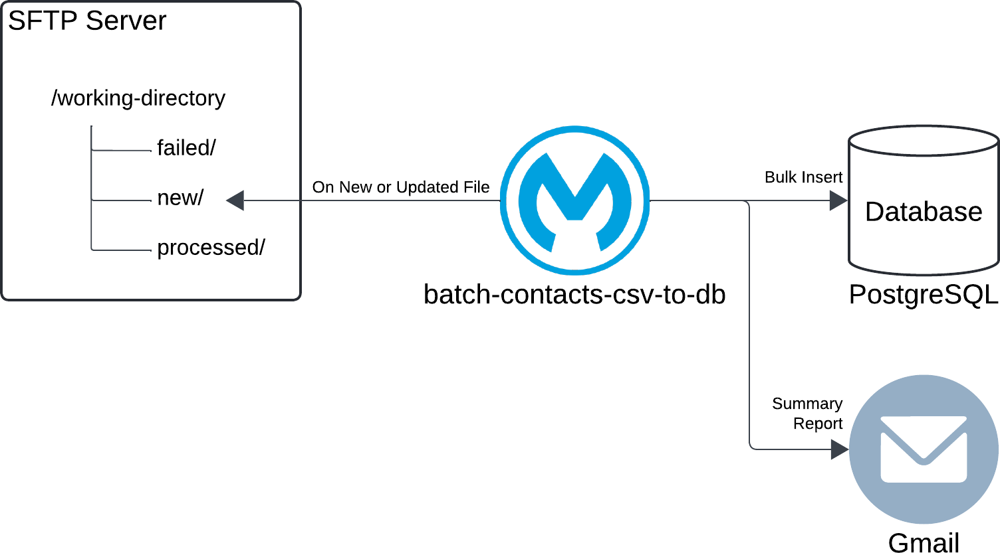
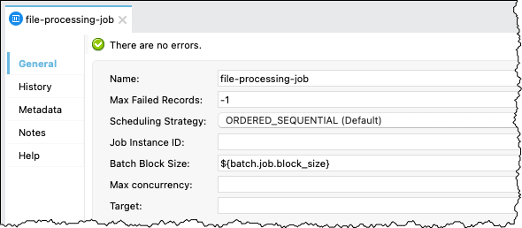

# Mule Project `batch-contacts-csv-to-db` Overview

I originally created the Mule project `batch-contacts-csv-to-db` in October 2022 as part of a proof of concept to process millions of records using Mule 4. The high-level requirements included reading a CSV file and inserting the data into a database. Over the past few years, I have evolved it to explain and demonstrate how to implement a batch job in Mule 4. In this revision, my goal was not to implement a particular use case but to serve as a comprehensive example that illustrates the art of the possible.

As the diagram illustrates, this Mule implementation monitors the `new` subdirectory for a new or updated file on an SFTP server. It expects a CSV file that contains contact data. When it finds a new or updated file, it reads the contact data and bulk inserts it into a PostgreSQL database within a Batch Job component. Upon completing the Batch Job, it sends a summary report via Gmail.

## Implementation Overview

> [!NOTE]
> The content in this section assumes 1) you are familiar with Anypoint Studio and building Mule flows, and 2) you cloned or downloaded the Anypoint Studio projects from GitHub and imported them into Anypoint Studio. As such, it intentionally does not provide a lot of details about the implementation and does not include XML snippets.

I implemented the Contacts CSV File to Database example as an integration - i.e., it does not expose a REST endpoint. As such, the implementation leverages two Mule configuration (XML) files as per MuleSoft best practices.

- The file `global.xml` stores all global elements, which is useful when a project contains multiple Mule configuration files - e.g., you do not have to look in each file to find a specific global element.
- The file `batch-contacts-csv-to-db-impl.xml` contains the implementation.

Naturally, the project leverages a properties file. It is in YAML format, and the naming convention is `mule-props-<environment>` to support environment-specific files – e.g., `mule-props-dev.yaml`, `mule-props-test.yaml`, `mule-props-staging.yaml`.

> [!IMPORTANT]
> As per infosec best practices, this repo and the project do not include the environment-specific properties files as they contain credentials. However, the template enables you to create properties files specific to your own implementation and resources.

### Mule Configuration File `global.xml`

In the `global.xml` file, notice the `Global Property` element named `env`, which specifies the current environment - e.g., `dev` in the screen capture.

> [!TIP]
> This typical practice enables you to override this property when deploying your application to higher environments (e.g., test, staging, prod), which results in picking up the properties file specific to that environment.

Similarly, notice the `Configuration properties` element and its value that follows the naming convention of `mule-props-<environment>` to support environment-specific files.

### Mule Configuration File `batch-contacts-csv-to-db-impl.xml`

As mentioned before, the Mule configuration file `batch-contacts-csv-to-db-impl.xml` contains the implementation of the Contacts CSV File to Database example.

As the screen capture illustrates, I implemented three Mule flows

- `contacts-batch-process-flow` is the main flow.
- `initialization-flow` and `send-email-report-flow` are child flows I leveraged to declutter the main flow (arguably).

#### Child Flow `initialization-flow`

As its name implies, I implemented the child flow `initialization-flow` to handle initialization tasks. In this implementation, this child flow primarily sets variables for convenience.

- The variable `startTime` captures the overall process start time to report how long it took to process the contact data.
- The variable `currentFilename` captures the name of the file from the attributes before it gets overridden by another processor.
- The variable `timestamp` captures the current timestamp for convenience. I use it to create file names and ensure consistency and traceability.
- The variable `newFilename` captures the name used when moving and renaming the processed file. It is a combination of the variables `currentFilename` and `timestamp`. I use this practice to indicate when the file was processed (e.g., `Contact_Data_1m.20250506T224149099.csv`).
- The variable `errorsFilename` captures the name of a new file where I write errors that occurred in the Batch Job (e.g., `Contact_Data_1m.20250506T224149099.errors.json`).

#### Child Flow `send-email-report-flow`

As its name implies, I implemented the child flow `send-email-report-flow` to send the summary report via Gmail upon completion of the Batch Job.

As the screen capture illustrates, I leveraged a [`Parse Template` processor](https://docs.mulesoft.com/mule-runtime/latest/parse-template-reference) to create the email body. You can find the template in the subfolder [`src/main/resources/parse-template`](../anypoint-studio-projects/batch-contacts-csv-to-db/src/main/resources/parse-template/contacts-batch-report-email.template). As stated before, I send the email summary report using Gmail. Naturally, you could easily update the configuration to leverage any other email service or server.

#### Main Flow `contacts-batch-process-flow`

The following screen capture provides a high-level overview of the main flow `contacts-batch-process-flow`.

As the diagram in the [Introduction section](#introduction) illustrates, the `On New or Updated File` processor monitors the subfolder `new` for a new or updated file. The error handler, however, moves the file to the subfolder `failed` if an error or a failure occurs during processing.

> [!NOTE]
> As mentioned in the [Batch Processing article in the MuleSoft documentation](https://docs.mulesoft.com/mule-runtime/latest/batch-processing-concept#error-handling), "*the Batch Job component handles any record-level failure that occurs to prevent the failure of an entire batch job*". In other words, the Error Handler would only catch errors that occur outside of the Batch Job component, both before and after.

As stated in the [Batch Processing article in the MuleSoft documentation](https://docs.mulesoft.com/mule-runtime/latest/batch-processing-concept#valid_input), the Batch Job component "*accepts any Java Iterables, Iterators, or Arrays, as well as JSON and XML payloads*". I added the `Transform Message CSV to Java` processor as CSV is not a valid input to the Batch Job component.

> [!TIP]
> As a reminder, when executing an application, the Mule runtime logs minimal information and none in most cases. As the screen capture illustrates, I use trace loggers extensively in all my implementations to provide visibility into the flows and steps. Also, the trace loggers are extremely helpful for unit testing and debugging.

The following screen capture provides an overview of the Batch Job `file-processing-job`.

As this screen capture illustrates, I leveraged two Batch Step components:

1. The Batch Step `main-processing-step` implements the load process (as in Extract, Transform, and Load, or ETL) - i.e., it bulk inserts all contact data into the database.
2. The Batch Step `failed-records-processing-step` handles any records that were not processed successfully in the previous step - e.g., validation failed, error while inserting into the database.

Now, let's briefly review some of the components and processors. First, review the configuration of the Batch Job `file-processing-job`.

- I configured the `Max Failed Records` setting to -1 (for no limit) and the `Batch Block Size` setting (via a property) but used default values for all other settings.

Next, review the configuration of the Batch Step `main-processing-step`.

- I used the default value `NO_FAILURES` for the `Accept Policy` setting, filtering any record that might not have been processed successfully before reaching this step.

Now, review the components included in the Batch Step `main-processing-step`.

- In this example and implementation, I intentionally added only a single processor, the `Validation Is email` operation, in the `Processors` section of the Batch Step component. Naturally, you can add as many processors as needed to meet your requirements. Remember that those processors are applied to every single record, one by one, which will likely increase the overall processing time.

Review the configuration of the Batch Aggregator `main-records-aggregator`.

- I configured the `Aggregator Size` setting (via a property) and enabled the setting `Preserve Mime Types`. As its name implies, the Batch Aggregator gathers records per the `Aggregator Size` setting and passes an array to the processors it contains for processing. Assuming an aggregator size of 1,000, for example, the `Transform Message CSV to SQL` and the `Bulk Insert Contact Data` processors would process 1,000 records at a time.

> [!NOTE]
> I intentionally leveraged the same data model for the CSV file and the database table. Hence, the `Transform Message CSV to SQL` processor implements a straightforward DataWeave mapping with no real transformations.

Next, review the configuration of the Batch Step `failed-records-processing-step`.

- I used the value `ONLY_FAILURES` for the `Accept Policy` setting to filter out all successful records. As mentioned, this step handles any records not processed successfully in the previous steps.

Now, review the components included in the Batch Step `failed-records-processing-step`.

- Here again, I intentionally kept my implementation simple while illustrating the art of the possible:
  - The `Transform Message Create Error Record` processor handles each failed record individually, creating a rudimentary JSON object that includes the error and the record itself to help troubleshoot the issue.
  - The Batch Aggregator `failed-records-aggregator` collects all the rudimentary JSON objects and writes them to a dedicated errors file on the SFTP server within the `processed` subdirectory alongside the processed file. Naturally, you could easily implement something else - e.g., send the errors as an attachment within an email.

Finally, review the `On Complete` section of the Batch Job component.

- Once again, I intentionally kept my implementation simple while illustrating the art of the possible.

  - I log the entire batch job report object, which provides statistics and additional information about the batch job execution.

  - As mentioned, I send a summary report via Gmail. The following is an example.

  
  

